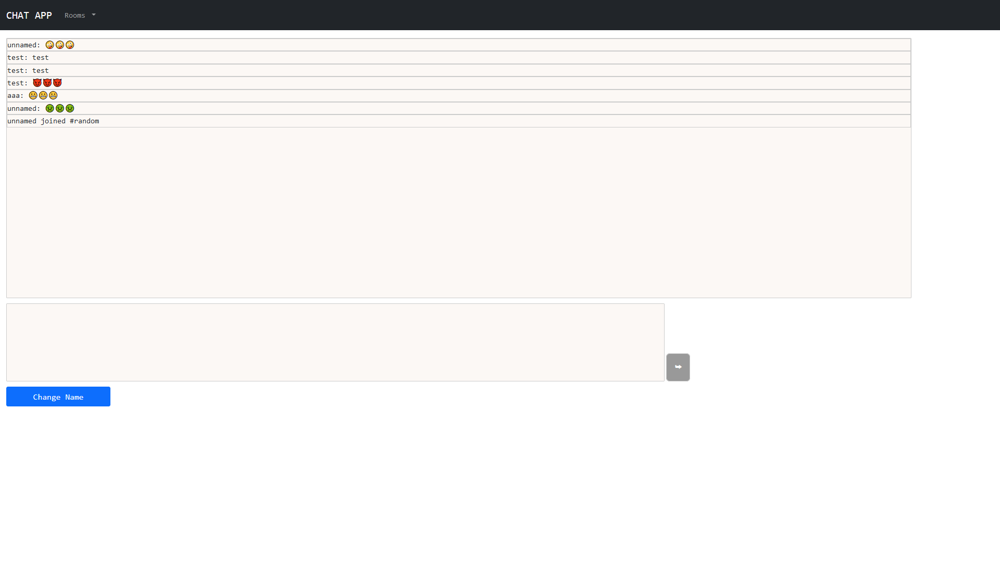

# Chat Application
Real time chat web application implemented using Socket.IO libraries and Angular framework  

[Website Link](https://damp-hollows-32652.herokuapp.com)  
[Git Repo](https://github.com/nodejsgithubuser/chatserver)

## Details
* Uses MongoDB/Mongoose for storage
* Designed as an SPA using Angular framework
* Uses Socket.IO libraries on the server and client
* Hosted on Heroku

